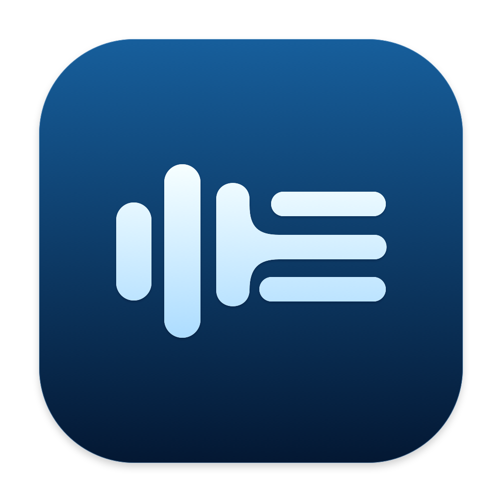
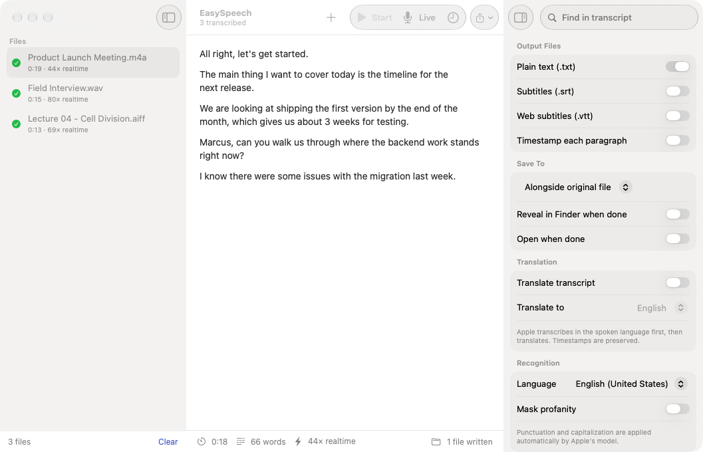
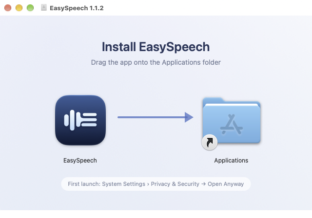
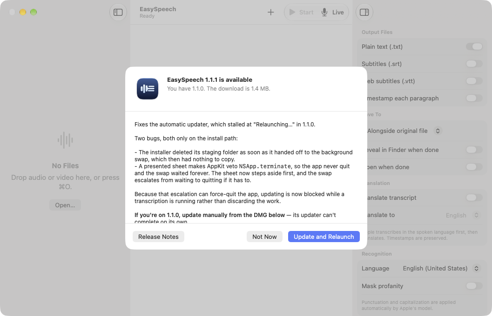

# EasySpeech



Fast, native macOS transcription powered entirely by **Apple's on-device Speech framework**.

No cloud, no API keys, no models to download and manage, no Python, no Electron, no FFmpeg. Audio never leaves your Mac. The whole app is a 1.2 MB download with zero dependencies.



---

## Features

- **Batch queue** — drop in a pile of files, processed one at a time
- **Live transcription** from the microphone, and **menu bar dictation**: start from the status item, talk, stop, and the text is on your clipboard
- **`.txt`, `.srt` and `.vtt`** output, with real word-level timestamps so subtitle cues break at natural pauses
- **Translation** to 20+ languages, on-device, timestamps preserved
- **Any common format** — mp3, m4a, wav, aiff, flac, mp4, mov and more, decoded in-process with no conversion step
- **Automatic updates** that don't make you repeat the macOS security approval
- Drag & drop, Finder *Open With*, full menu bar and keyboard shortcuts, light/dark/system appearance
- Never overwrites an existing file

## Performance

A **3 hour 38 minute** podcast transcribes in **167 seconds** — 78× realtime — using **20 MB** of memory and only 20 seconds of CPU. The Neural Engine does the recognition, so the machine stays responsive.

Memory is flat regardless of length: a 3.6-hour file and a 30-second file both sit around 20 MB.

## Requirements

**macOS 26 or later** on Apple Silicon. `SpeechAnalyzer` doesn't exist before macOS 26.

---

## Install

Download the DMG from the [latest release](https://github.com/gulfvideo/easy-speech-ui/releases/latest) and drag EasySpeech onto Applications.



### First launch is blocked by macOS

EasySpeech isn't signed with an Apple Developer ID, so macOS refuses to open it the first time. This is expected for any independently distributed app that hasn't paid Apple's $99/yr developer fee.

1. Try to open EasySpeech once, and let it be blocked.
2. Open **System Settings › Privacy & Security**.
3. Scroll to the message about EasySpeech and click **Open Anyway**.

You only do this once — updates never ask again. On macOS 15+, right-click → *Open* no longer works for this; the Privacy & Security route does.

Prefer to build it yourself? It's ~2,900 lines of Swift with no dependencies:

```bash
git clone https://github.com/gulfvideo/easy-speech-ui.git
cd easy-speech-ui && ./build.sh && open build/EasySpeech.app
```

A locally built copy is never quarantined, so none of the above applies.

## Updates

EasySpeech checks its releases once a day. **Update and Relaunch** downloads, verifies and swaps the app in place, usually in under two seconds. There's a Check Now button and an off switch in **Settings › Updates**.



Updates don't re-trigger the security prompt, because macOS only quarantines what a *browser* downloads — and the download is verified against the SHA-256 GitHub publishes before anything is installed. [How that works](CONTRIBUTING.md#updates).

---

## Known limits

- **45 languages.** Settings › Languages lists them.
- **No custom models.** Apple manages the acoustic model, so there's no size/quality picker.
- **Punctuation is always on.** Apple gives no toggle, so the app doesn't pretend to offer one.
- **Apple Silicon, macOS 26+.** No fallback for older systems.
- Translation quality is Apple's — good for major languages, weaker for rare pairs.

## Contributing

Build with `./build.sh`, package with `./package.sh`. See [CONTRIBUTING.md](CONTRIBUTING.md) for the project layout and the non-obvious things worth knowing before changing the engine.

## Support

EasySpeech is free, has no ads, collects nothing and never will. If it saved you some time, you're welcome to [buy me a coffee](https://buymeacoffee.com/gulfvideo) — entirely optional, and it doesn't unlock anything, because there's nothing locked.

<a href="https://buymeacoffee.com/gulfvideo"></a>

## License

MIT — see [LICENSE](LICENSE).

## Credits

Inspired by [EasyWhisperUI](https://github.com/mehtabmahir/easy-whisper-ui) by [mehtabmahir](https://github.com/mehtabmahir) — a great, genuinely useful app, and the reason this one exists. If you need broader language coverage or specific Whisper models, go use it.
